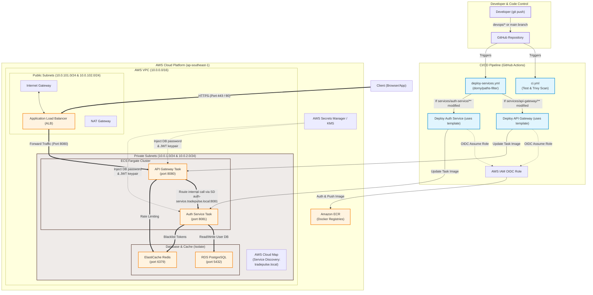
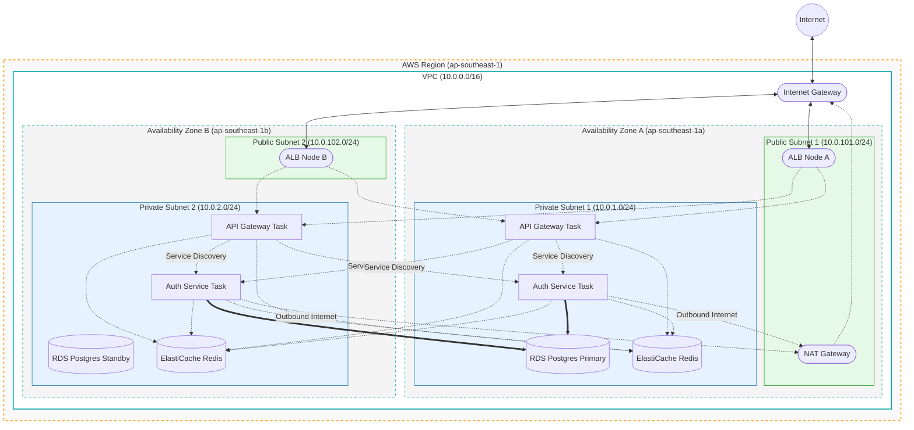

# TradePulse Deployment Architecture & CI/CD Pipeline

This document illustrates the complete workflow from the developer pushing code to GitHub, running through the **CI/CD pipeline (GitHub Actions)**, and automatically deploying to **AWS Cloud Infrastructure** managed by **Terraform**.

## 1. System Deployment Architecture (Mermaid Diagram)

---

## 2. Component Explanations

### A. CI/CD Pipeline Flow (GitHub Actions)
1. **Continuous Integration (CI):** Triggered on pushes to any branch. `ci.yml` runs maven tests and scans dependencies using **Trivy** to find vulnerabilities.
2. **Continuous Delivery (CD):** Triggered on `main` or `devops/*` branches. `deploy-services.yml` uses `dorny/paths-filter` to determine which service changed code:
   - Reusable template `deploy-ecs-template.yml` is called to dynamically authenticate with AWS via **IAM OIDC** (role-based authentication).
   - Builds the Docker image, tags it with the commit SHA, and pushes it to **Amazon ECR**.
   - Registers a new **ECS Task Definition** revision and initiates a rolling deploy on **AWS ECS Fargate**.

### B. Network Traffic Routing Flow (VPC Subnets)
1. **External Access:** End-users reach the public **Application Load Balancer (ALB)** positioned in the Public Subnets.
2. **Internal Proxying:** ALB terminates SSL (HTTPS) and routes traffic over HTTP to the **API Gateway** task running inside Private Subnets.
3. **Internal Service Discovery:** The API Gateway inspects the HTTP request path and routes internal microservice requests to `auth-service` via **AWS Cloud Map** (Service Discovery) using internal DNS resolution (`auth-service.tradepulse.local:8081`).

### C. Databases, Cache & Security
- **Isolation:** **RDS PostgreSQL** (port 5432) and **ElastiCache Redis** (port 6379) are completely isolated in private subnets, only allowing internal traffic from ECS task security groups.
- **Secrets Management:** When containers launch, AWS Secrets Manager injects database credentials and JWT keypairs directly into the ECS task as secure environment variables, utilizing **AWS KMS** for encryption at rest.

## 3. AWS Infrastructure Topology (Network & Security)

This diagram focuses purely on the AWS Networking and High Availability setup across Multiple Availability Zones (Multi-AZ).

