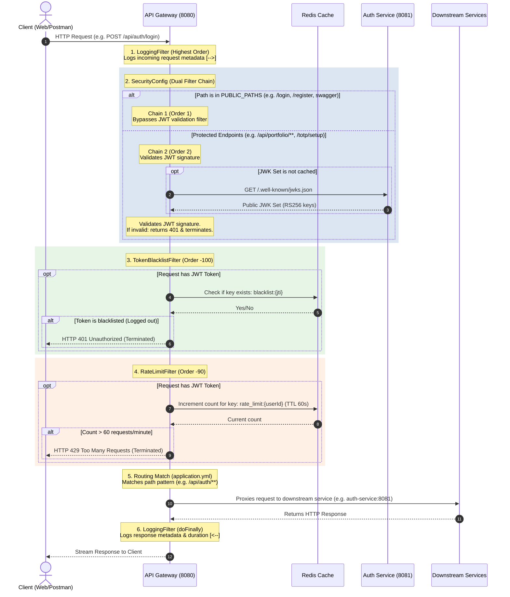

# TradePulse - API Gateway Architecture

This document provides a detailed visual diagram and technical breakdown of the API Gateway (`api-gateway-service`) request flow in the TradePulse system, based on our implementations.

---

## 1. Request Flow Diagram

Below is the sequence diagram illustrating how a client request is received, processed by the filter pipeline, validated against security/caching policies, and routed downstream.

---

## 2. Key Components Breakdown

### 1. `LoggingFilter` (WebFilter, `Ordered.HIGHEST_PRECEDENCE`)
*   **Role**: Access logging.
*   **Execution**: Operates before Spring Security. This guarantees that every request—whether successful, rate-limited, or blocked by security—is logged to stdout.
*   **Mechanism**: Captures the entry timestamp synchronously, passes execution downstream, and registers an asynchronous `.doFinally()` callback to measure response execution time (`ms`) and print the final request status.

### 2. `SecurityConfig` (Spring Security WebFilterChain)
*   **Role**: Endpoint access control.
*   **Dual Chain Mechanism**:
    1.  **Public Chain (`Order(1)`)**: Match requests configured in `PUBLIC_PATHS`. Does not apply any JWT resource server filters. Stale/expired Bearer tokens supplied in headers are ignored.
    2.  **Protected Chain (`Order(2)`)**: Handles all other requests. Mandates a valid JWT signature verified via the `jwk-set-uri` parameter.

### 3. `TokenBlacklistFilter` (GlobalFilter, `Order(-100)`)
*   **Role**: Block access from tokens belonging to logged-out sessions.
*   **Execution**: Triggered only for authenticated requests.
*   **Mechanism**: Queries Redis asynchronously using the token's unique ID (`jti`) as the key (`blacklist:<jti>`). If the key exists, the request is immediately aborted with `401 Unauthorized`.

### 4. `RateLimitFilter` (GlobalFilter, `Order(-90)`)
*   **Role**: Prevent API flooding (spams/DDOS).
*   **Execution**: Triggered only for authenticated requests.
*   **Mechanism**: Increments the key `rate_limit:<userId>` in Redis using atomic operations with a 60-second sliding expiration TTL. Denies requests exceeding 60 requests per minute with `429 Too Many Requests`.

### 5. Routing Router (Spring Cloud Gateway Engine)
*   **Role**: Dynamic packet forwarding.
*   **Mechanism**: Resolves route criteria statically loaded from `application.yml`'s `spring.cloud.gateway.routes` configuration. Proxies requests asynchronously through Netty's reactive HTTP client to the designated port.
