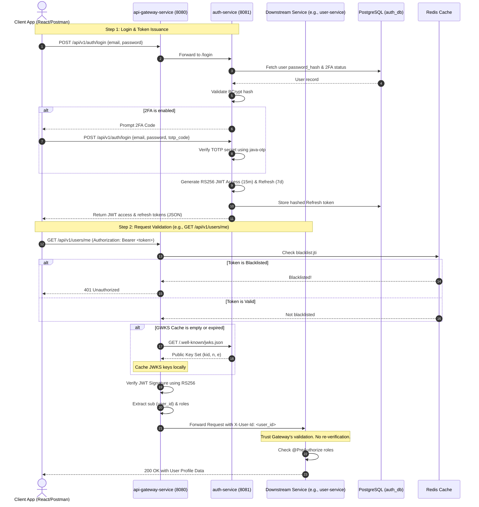
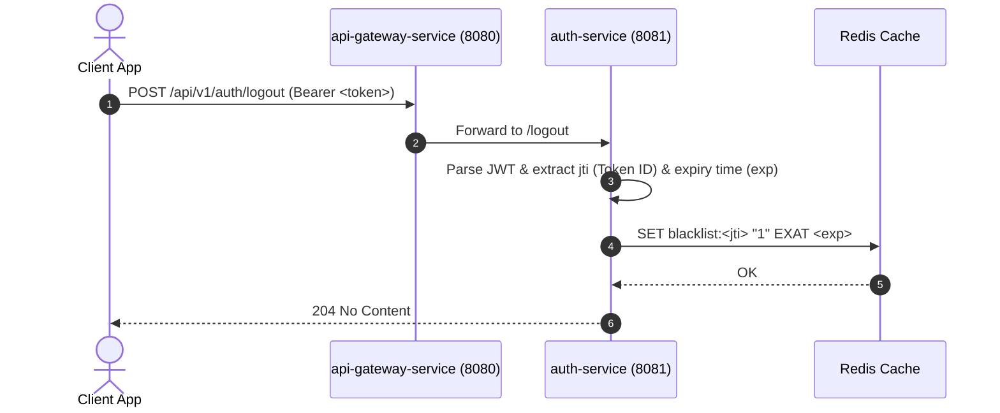
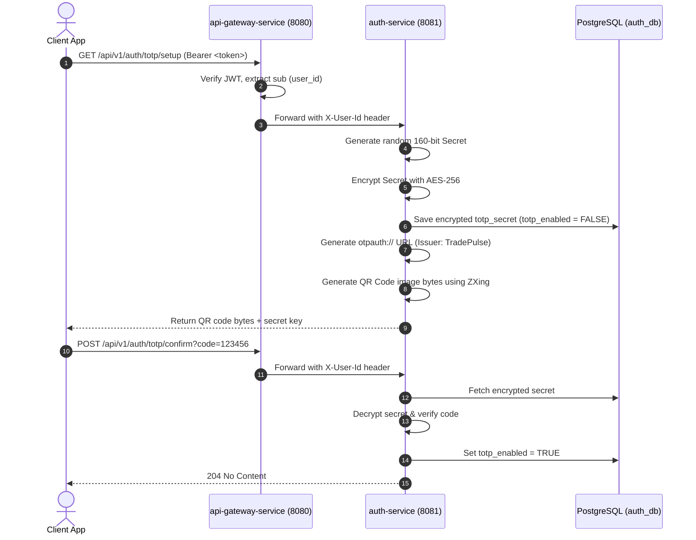

# TradePulse — Authentication & Security Flow

This diagram illustrates the login process, JWT token generation, downstream request validation, and the 2FA setup flow.

## 1. Authentication & Request Validation Flow

## 2. Token Logout & Blacklisting Flow

## 3. TOTP 2FA Provisioning Flow

