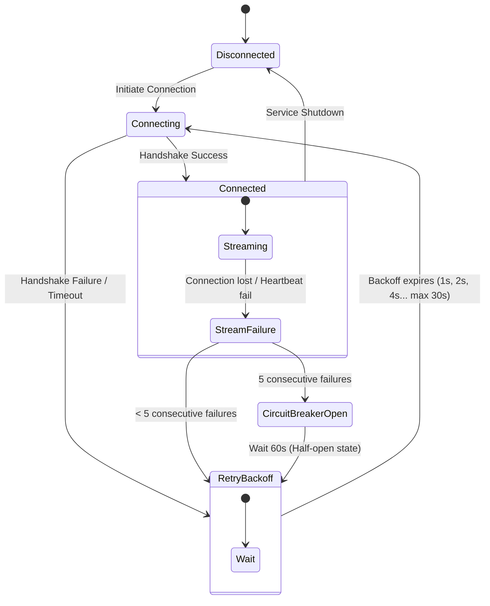

# TradePulse — Market Data Streaming Flow

This diagram visualizes how real-time crypto prices are ingested from Binance, processed, cached, published, and streamed to active clients.

## 1. Market Data Ingestion & Distribution

```mermaid
graph TD
    classDef external fill:#e1f5fe,stroke:#0288d1,stroke-width:2px,color:#000;
    classDef service fill:#ede7f6,stroke:#651fff,stroke-width:2px,color:#000;
    classDef db fill:#fffde7,stroke:#fbc02d,stroke-width:1px,color:#000;
    classDef kafka fill:#fbe9e7,stroke:#ff5722,stroke-width:1px,color:#000;
    classDef client fill:#eceff1,stroke:#607d8b,stroke-width:1px,color:#000;

    Binance("Binance WebSocket API<br/>(wss://stream.binance.com:9443)"):::external
    
    subgraph Service ["market-data-service (Port 8083)"]
        WSClient("BinanceWebSocketClient.java<br/>(WebFlux WebClient / Netty)"):::service
        Normalizer("Anti-Corruption Layer<br/>(Normalize to MarketTick)"):::service
        STOMPServer("STOMP WebSocket Server"):::service
    end

    subgraph Storage ["Polyglot Storage & Cache"]
        Mongo("MongoDB<br/>(market_ticks collection)"):::db
        Redis("Redis Cache<br/>(price:{SYMBOL}, TTL: 30s)"):::db
    end

    subgraph EventStream ["Kafka Cluster"]
        MarketDataTopic("market-data topic<br/>(10 partitions, key: symbol)"):::kafka
    end

    subgraph Consumers ["Kafka Price Consumers"]
        Engine("matching-engine (8086)<br/>(Triggers Limit Order matches)"):::service
        NotifSvc("notification-service (8087)<br/>(Checks user price alerts)"):::service
    end

    Client("Web Client (UI / React)"):::client

    %% Inflow
    Binance -->|1. Real-time ticker stream| WSClient
    WSClient -->|2. Raw JSON| Normalizer
    
    %% Processing and outbound
    Normalizer -->|3. Insert historic tick| Mongo
    Normalizer -->|4. SET price:{SYMBOL} value| Redis
    Normalizer -->|5. Publish MarketDataEvent| MarketDataTopic
    Normalizer -->|6. Push update| STOMPServer
    
    %% Broadcasting to client
    STOMPServer -->|7. STOMP Stream (/topic/prices)| Client
    
    %% Downstream consumer triggers
    MarketDataTopic -->|8. Consume price events| Engine
    MarketDataTopic -->|8. Consume price events| NotifSvc
```

## 2. Ingestion Resilience & Reconnection


