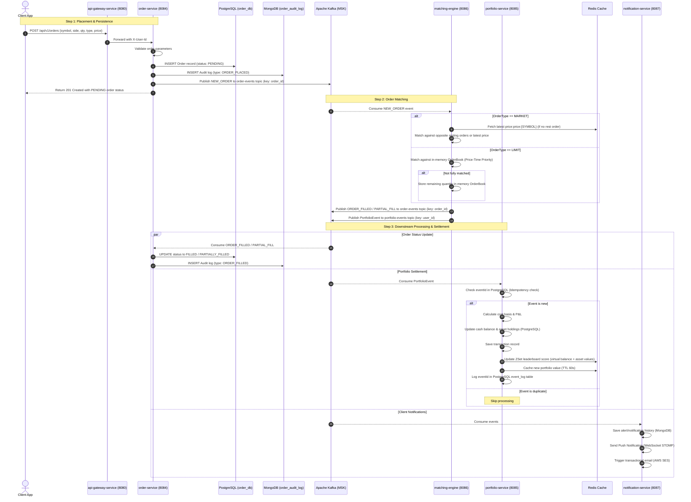
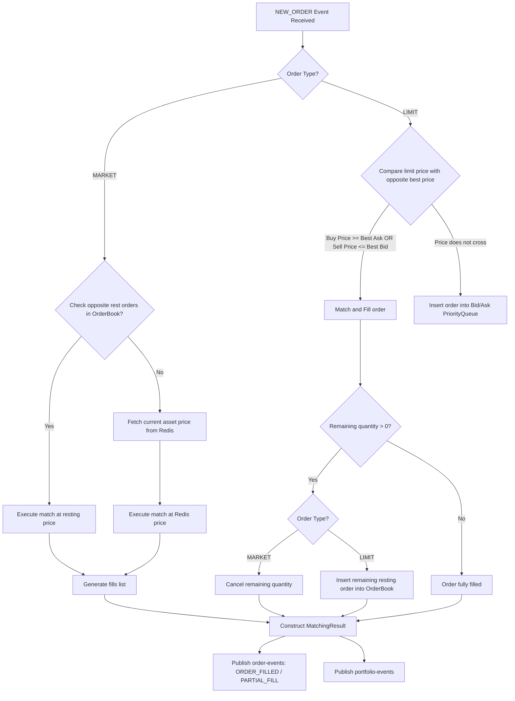

# TradePulse — Order Placement, Matching & Execution Flow

This document details the lifecycle of an order from submission to matching, ledger updates, and client notifications.

## 1. End-to-End Order Processing Flow

## 2. matching-engine Matching Flowchart

