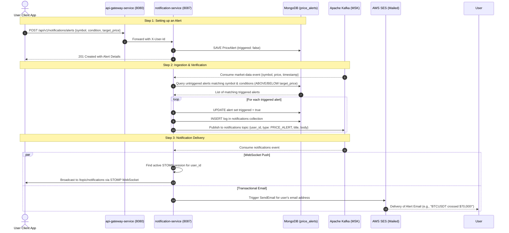

# TradePulse — Price Alert & Notification Flow

This diagram illustrates the price alert setup, ingestion, trigger mechanism, and delivery pipeline.

```mermaid
sequenceDiagram
    autonumber
    actor Client as User Client App
    participant Gateway as api-gateway-service (8080)
    participant NotifSvc as notification-service (8087)
    participant Mongo as MongoDB (price_alerts)
    participant Kafka as Apache Kafka (MSK)
    participant AWS_SES as AWS SES (Mailed)

    Note over Client, Mongo: Step 1: Setting up an Alert
    Client->>Gateway: POST /api/v1/notifications/alerts {symbol, condition, target_price}
    Gateway->>NotifSvc: Forward with X-User-Id
    NotifSvc->>Mongo: SAVE PriceAlert (triggered: false)
    NotifSvc-->>Client: 201 Created with Alert Details

    Note over Kafka, Client: Step 2: Ingestion & Verification
    Kafka-->>NotifSvc: Consume market-data event {symbol, price, timestamp}
    NotifSvc->>Mongo: Query untriggered alerts matching symbol & conditions (ABOVE/BELOW target_price)
    Mongo-->>NotifSvc: List of matching triggered alerts
    
    loop For each triggered alert
        NotifSvc->>Mongo: UPDATE alert set triggered = true
        NotifSvc->>Mongo: INSERT log in notifications collection
        NotifSvc->>Kafka: Publish to notifications topic {user_id, type: PRICE_ALERT, title, body}
    end

    Note over Kafka, Client: Step 3: Notification Delivery
    Kafka-->>NotifSvc: Consume notifications event
    
    par WebSocket Push
        NotifSvc->>NotifSvc: Find active STOMP session for user_id
        NotifSvc->>Client: Broadcast to /topic/notifications via STOMP WebSocket
    and Transactional Email
        NotifSvc->>AWS_SES: Trigger SendEmail for user's email address
        AWS_SES-->>User: Delivery of Alert Email (e.g., "BTCUSDT crossed $70,000!")
    end
```
