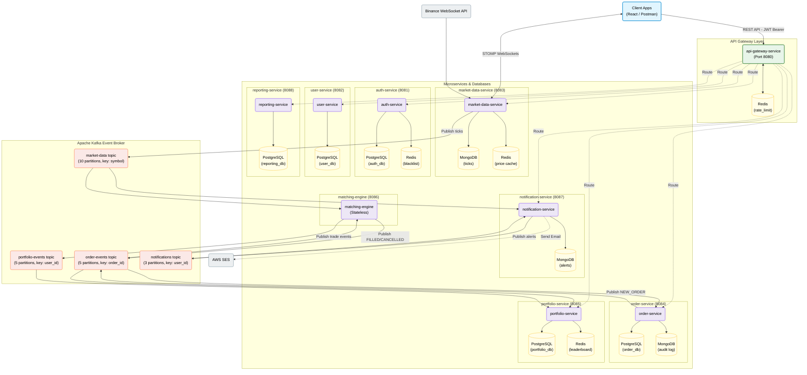

# TradePulse — System Architecture Diagram

This diagram visualizes the structural components of the TradePulse system, detailing microservices, external dependencies, data storage choices, and async event streams.

### Components Summary

1. **api-gateway-service**: Serves as the single entry point. Centralizes JWT verification, CORS policy, and Redis-backed rate limiting.
2. **auth-service**: Manages user registration, JWT generation (RS256), token refreshing, logout blacklisting (Redis), and TOTP 2FA. Exposes a JWKS endpoint for gateway validation.
3. **user-service**: Handles user profiles, virtual balance, and displays the global leaderboard fetched from Redis.
4. **market-data-service**: Subscribes to Binance WebSocket. Normalizes ticks, stores history in MongoDB, caches real-time price in Redis, publishes to Kafka, and broadcasts to user UI via STOMP WebSocket.
5. **order-service**: Validates and creates orders in PostgreSQL, publishes order events to Kafka, and writes append-only event logs in MongoDB.
6. **matching-engine**: A fast, memory-based, stateless matching engine that processes buy/sell limit and market orders using the Kafka `market-data` and `order-events` streams.
7. **portfolio-service**: Tracks user holdings, calculates real-time profit and loss (P&L) using prices from Redis, and maintains the global leaderboard in a Redis Sorted Set (`ZSet`).
8. **notification-service**: Manages price alerts (MongoDB), listens for system events (Kafka), and sends transactional notifications (STOMP WebSocket & AWS SES).
9. **reporting-service**: Compiles PDF statements using iText7 and handles uploads/downloads via AWS S3 presigned URLs.
