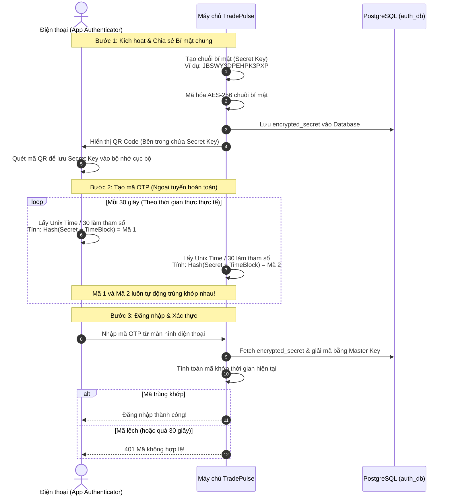

# Tìm Hiểu Về Bảo Mật JWT (RS256) & Cơ Chế 2FA (TOTP)

Tài liệu này ghi chép lại các khái niệm bảo mật cốt lõi được áp dụng trong dự án **TradePulse**, bao gồm cơ chế ký số RS256, hoạt động của API Gateway, và cách hoạt động ngoại tuyến (offline) của mã bảo mật 2 lớp (TOTP 2FA).

---

## 1. Cơ Chế Khóa Bất Đối Xứng (RS256) trong JWT

Khác với thuật toán đối xứng HS256 (sử dụng một mật mã duy nhất để cả ký và đọc), thuật toán bất đối xứng **RS256** sử dụng một cặp khóa toán học đặc biệt:

*   **Private Key (Khóa bí mật):** Chỉ duy nhất `auth-service` giữ và dùng để **Ký (Sign)** tạo ra mã token JWT.
*   **Public Key (Khóa công khai):** Được công bố rộng rãi (qua endpoint JWKS). `api-gateway` và các service khác lấy về để **Xác thực (Verify)** tính nguyên bản của token.

### 🖼️ Hình ảnh ẩn dụ "Con Dấu Sáp Hoàng Gia"

```
[auth-service] giữ Con Dấu Sáp độc quyền (Private Key)
       │
       ├─► Ký vào token JWT (Tạo ra một dấu sáp độc bản gắn vào token)
       │
[api-gateway] giữ Khuôn Đúc đối chiếu (Public Key)
       │
       ├─► Áp khuôn đúc vào dấu sáp trên token.
       │   - Nếu khớp hoàn toàn ──► Token hợp lệ (Tin tưởng!)
       │   - Nếu sáp bị méo hoặc khuôn không khớp ──► Token giả mạo/bị chỉnh sửa! (Chặn đứng!)
```

---

## 2. Bản Chất Của Chữ Ký (Signature) & Quy Trình Chống Giả Mạo

### ⚠️ Lưu ý cốt lõi: JWT không hề che giấu dữ liệu!
Một chuỗi JWT gồm 3 phần dạng: `Header.Payload.Signature` được mã hóa Base64Url. Bất kỳ ai cũng có thể giải mã phần `Payload` để xem thông tin bên trong (như `userId`, `roles`). 

**Bảo mật của JWT không phải là "che giấu thông tin" mà là "chống chỉnh sửa thông tin".**

---

### Quy Trình Ký và Xác Thực Token

```mermaid
graph TD
    classDef step fill:#e1f5fe,stroke:#0288d1,stroke-width:2px,color:#000;
    classDef key fill:#ede7f6,stroke:#651fff,stroke-width:1px,color:#000;
    classDef warning fill:#ffebee,stroke:#c62828,stroke-width:1px,color:#000;

    subgraph SignFlow ["1. Quy Trình Ký (Tại auth-service)"]
        A["Dữ liệu gốc (Header + Payload)"]:::step
        B["Hàm băm SHA-256"]:::step
        C["Mã băm (Hash: 12345)"]:::step
        D["Mã hóa bằng Private Key"]:::step
        E["Chữ Ký (Signature: CCCC)"]:::step
        PrivKey["Private Key (Secret)"]:::key

        A --> B
        B --> C
        C --> D
        PrivKey --> D
        D --> E
    end

    subgraph VerifyFlow ["2. Quy Trình Xác Thực (Tại API Gateway)"]
        F["Nhận Token: Header.Payload.Signature"]:::step
        G1["Gateway tự băm: Header + Payload"]:::step
        H1["Mã băm tính toán (Hash A)"]:::step
        
        G2["Dùng Public Key giải mã Signature"]:::step
        H2["Mã băm nguyên thủy (Hash B)"]:::step
        PubKey["Public Key (JWKS)"]:::key

        Compare{"So sánh: Hash A == Hash B ?"}:::step
        Success["Token hợp lệ - Cho phép qua!"]:::step
        Fail["Token bị giả mạo - Block 401!"]:::warning

        F --> G1
        G1 --> H1
        
        F --> G2
        PubKey --> G2
        G2 --> H2

        H1 --> Compare
        H2 --> Compare
        Compare -->|Khớp| Success
        Compare -->|Không khớp| Fail
    end
```



### Tại sao Hacker sửa Payload lại bị phát hiện?
Khi hacker lén lút sửa Payload từ `USER` thành `ADMIN`:
1.  Hacker gửi token mới lên: `Header.Payload(ADMIN).Signature(CCCC)` (Chữ ký `CCCC` là của Payload cũ `USER`).
2.  API Gateway dùng Public Key giải mã chữ ký `CCCC`, thu được mã băm gốc là `12345` (mã băm của chữ `USER`).
3.  Gateway tự băm phần Header + Payload mới nhận được, thu được mã băm mới là `99999`.
4.  Gateway so sánh `12345` (từ chữ ký) và `99999` (từ Header + Payload thực tế) $\rightarrow$ **Lệch nhau** $\rightarrow$ Request bị từ chối.
5.  Hacker muốn tạo ra chữ ký mới khớp với số `99999` thì bắt buộc phải có **Private Key**. Vì hacker không có, chữ ký giả sẽ không bao giờ khớp được.

---

## 3. Cơ Chế Xác Thực 2 Lớp (TOTP 2FA) Chạy Ngoại Tuyến (Offline)

Làm sao ứng dụng Authenticator trên điện thoại không cần kết nối mạng Internet vẫn tạo ra mã 6 số trùng khớp tuyệt đối với máy chủ của TradePulse? Bí mật nằm ở thuật toán **TOTP (Time-based One-Time Password)**.

### Quy trình đồng bộ:



### Các thư viện được sử dụng:
1.  **ZXing (Zebra Crossing):** Nhận link cấu hình OTP chứa Secret Key và thông tin user, sau đó vẽ thành đồ họa mã QR để thiết bị di động quét.
2.  **java-otp (hoặc tương tự):** Chạy thuật toán băm HMAC-SHA1 kết hợp thời gian hệ thống để tính mã 6 số ở phía Server, đồng thời hỗ trợ **Time Drift** (cho phép lệch ±30 giây đề phòng đồng hồ điện thoại của người dùng bị chạy chậm/nhanh).
3.  **AES-256 (Mã hóa ở DB):** Secret Key là "chìa khóa vàng" sinh ra mã OTP. Chúng bắt buộc phải được mã hóa bằng thuật toán đối xứng AES-256 trước khi lưu vào DB để đề phòng trường hợp DB bị rò rỉ.
